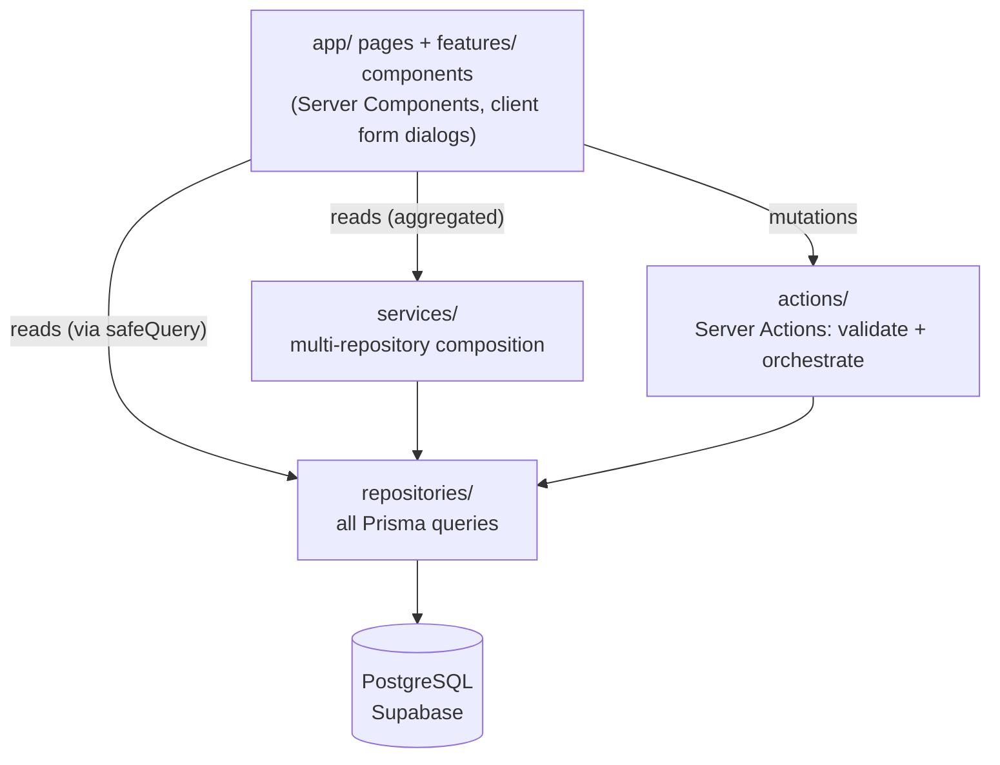

# Architecture Overview

Personal OS is a layered Next.js App Router application. Pages are Server
Components; mutations are Server Actions; all database access goes through
repositories.

## Layers

## Rules

1. **Components never touch Prisma.** Reads go through `repositories/`
   (optionally composed in `services/`); writes go through `actions/`.
2. **Every mutation path is:** Zod schema (`schemas/`) → server action
   (`actions/`) → repository → `revalidatePath`.
3. **Page reads are resilient:** wrapped in `lib/safe-query.ts` so an
   unreachable database renders empty states + a banner, never a crash.
4. **Services exist only when composition is needed** (e.g. dashboard stats).
   A page reading one repository calls it directly — no ceremonial layers.
5. **All data pages are `dynamic = "force-dynamic"`** — this is a live
   dashboard, nothing is prerendered with stale data.

## Request lifecycle (mutation)

1. Client form dialog (react-hook-form + zodResolver) validates locally
2. Submits typed input to a server action
3. Action re-validates with the same Zod schema (never trust the client)
4. Action normalizes ("" → null, string → Date/number) and calls the repository
5. `revalidatePath` refreshes affected routes; the dialog closes and toasts

See [folder-structure.md](./folder-structure.md), [database.md](./database.md),
and [diagrams/system-flow.md](../diagrams/system-flow.md).
