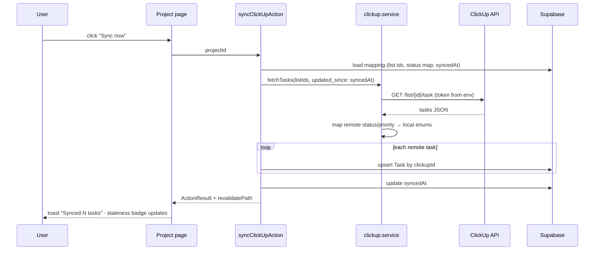
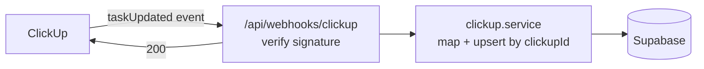

# ClickUp Sync Flow (planned — Phase 04)

Design per [ADR-003](../decisions/adr-003-clickup-sync.md): read-only first,
idempotent upsert by `clickupId`, manual trigger.

## Stage 1 — manual read-only sync

## Stage 2 — webhooks (after Stage 1 proven + app deployed)

## Rules

- Upsert only — a re-sync of unchanged data is a no-op.
- Remote deletions mark the local link stale (badge), never cascade-delete local work.
- Sync failures toast + log; pages keep rendering last-synced data with `syncedAt` shown.
