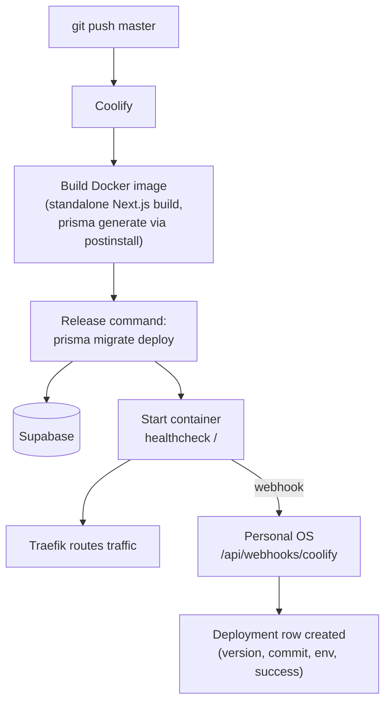
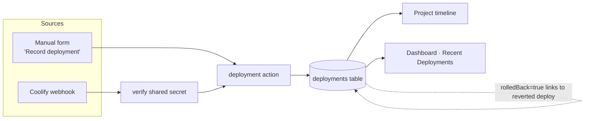

# Deployment Flow (planned — Phase 06)

Two flows: deploying Personal OS itself, and recording deployments of any
tracked project.

## Deploying Personal OS

## Recording any project's deployment

## Rollback rules

- Coolify redeploys the previous image; migrations are forward-only
  (expand → migrate → contract for destructive changes).
- A rollback is recorded as its own Deployment row referencing the one it reverts —
  history is append-only.
