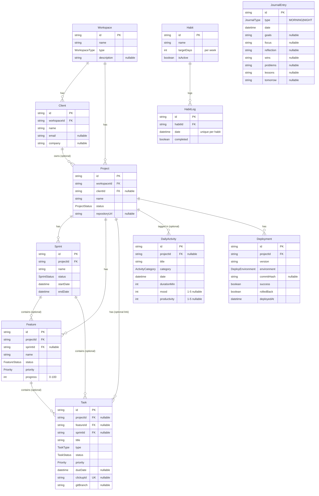

# Entity Relationship Diagram

Current schema (`prisma/schema.prisma`, migration `20260710141246_init`).
Regenerate this diagram whenever the schema changes.

## Delete behavior

- Cascade: Workspace → Clients/Projects; Project → Sprints/Features/Deployments; Habit → HabitLogs
- SetNull (link breaks, row survives): Client→Project, Sprint/Feature/Project→Task, Project→DailyActivity
- Every table also carries `createdAt` / `updatedAt` (omitted above for brevity).
