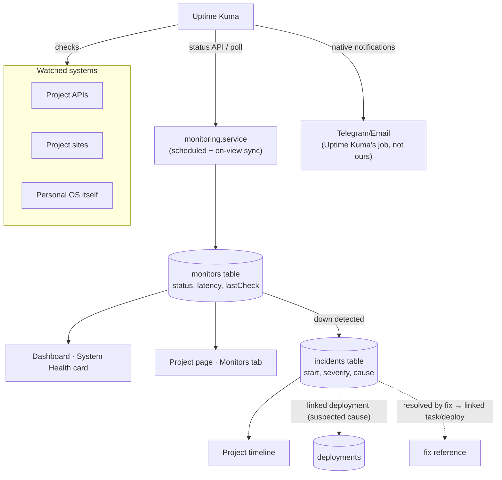

# Monitoring Flow (planned — Phase 07)

Uptime Kuma is the watcher; Personal OS aggregates its signal into project
context and links incidents to deployments and fixes.



## The incident chain

```
Monitoring detects ↓ → Incident opened → linked Deployment (cause?)
→ Fix task → fixing Deployment → Incident closed → visible in Reports
```

## Rules

- Personal OS **aggregates and links** — it never pages/alerts (Uptime Kuma does).
- Monitor sync failures degrade to "last known status + staleness", pages never break.
- Every incident closure requires a cause note — that text feeds Phase 12 AI summaries.
