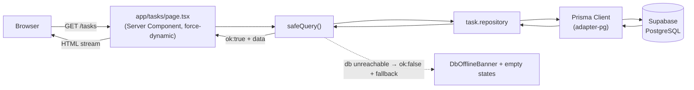
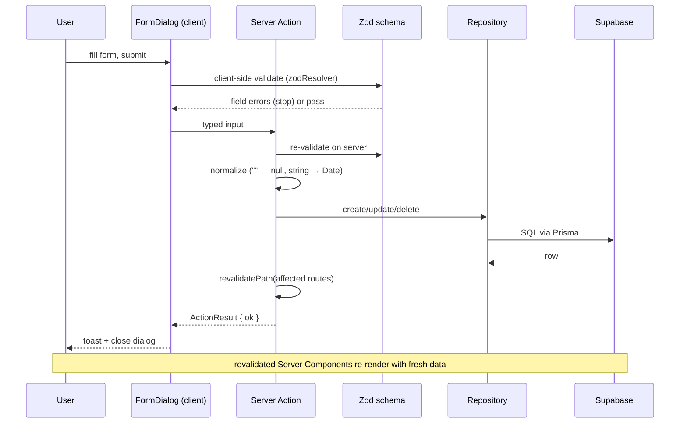

# System Flow

How a request moves through Personal OS today (Phases 01–02).

## Read path (page render)

## Write path (mutation)

## Future additions

- Phase 03 inserts an auth check at the top of every action and middleware in front of every page.
- Phases 04–07 add `services/<provider>.service.ts` between actions and external APIs
  (see [clickup-sync.md](./clickup-sync.md)) and webhook route handlers as inbound entry points.
